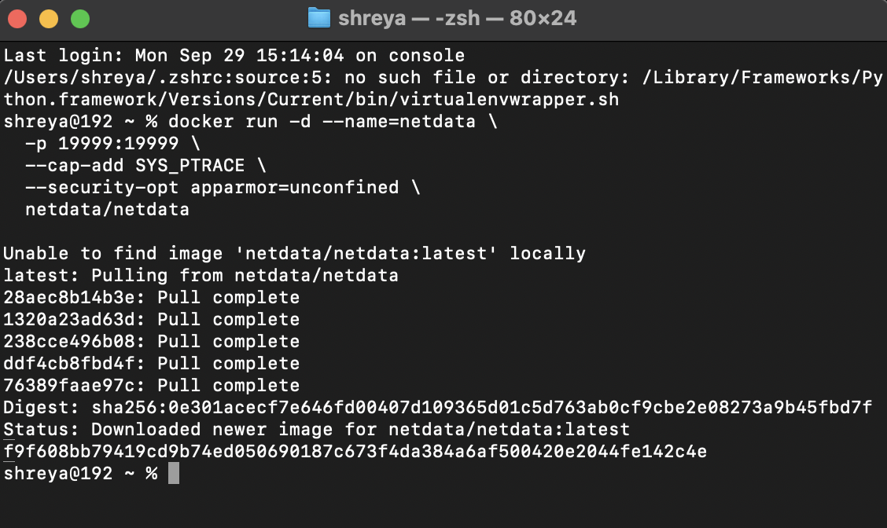
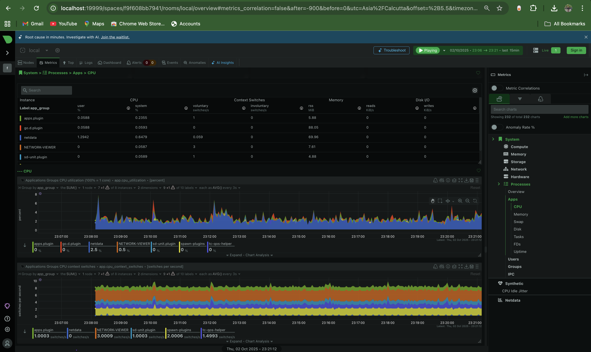
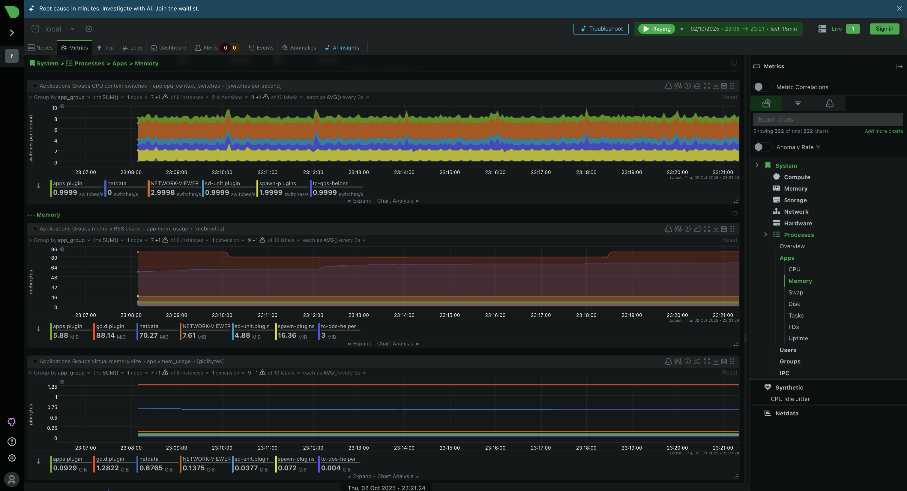

# ✅ TASK 7: Monitor System Resources Using Netdata

## 🎯 Objective
Install **Netdata** using Docker and visualize **real-time system and application performance metrics** through its web-based dashboard.

---

## 🚀 Installation & Setup (Using Docker)

Run the following command to start Netdata:

```bash
docker run -d --name=netdata \
  -p 19999:19999 \
  --cap-add SYS_PTRACE \
  --security-opt apparmor=unconfined \
  netdata/netdata
```

## 🌐 Access the Dashboard

Open your browser and go to:

http://localhost:19999

You will see a welcome screen.
Click on:

“Skip and use the dashboard anonymously.”

This will immediately open the full monitoring dashboard where you can see:

CPU Usage Graphs

RAM & Swap Utilization

Disk I/O & Filesystem

Network Traffic

Docker Containers (if any running)

# CPU


# MEMORY


## ✅ Outcome

By completing this task, you have:

✔ Set up lightweight real-time monitoring for servers or applications

✔ Understood how to analyze resource usage and system performance

✔ Gained exposure to DevOps monitoring tools used in production
